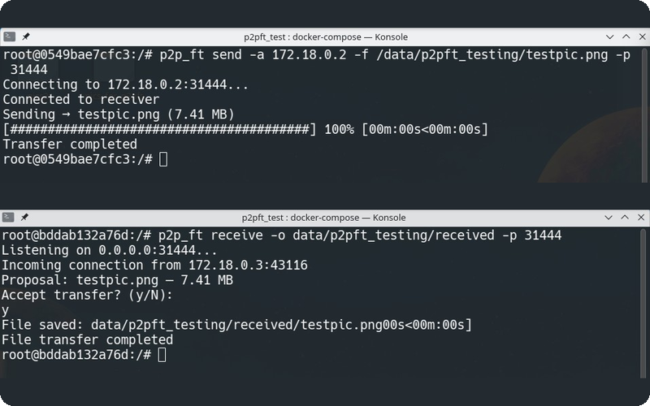

# Daniel Konoplański

### **C++ Software Engineer @ Nokia**

Building 4G/5G software used by over 1 billion users worldwide.

## Featured work

### [ramiel](https://github.com/daniel-konoplanski/ramiel)

Desktop hardware monitor for Linux — CPU, GPU, memory, storage, network and display, without root.

Reads sensors straight from sysfs/hwmon and draws live per-second charts on a dashboard you arrange yourself. Actively developed, with packaged releases.

`Rust` `Tauri v2` `Svelte`

 
 

### [p2p_ft](https://github.com/daniel-konoplanski/p2p_file_transfer)

Peer-to-peer file transfer for Linux — one command on each end, no server in between.

Direct TLS 1.2+ transfers over auto-generated ECDSA certificates, with chunked streaming, live progress, and an interactive approval prompt before anything touches disk.

`C++23` `Boost.Asio` `OpenSSL` `Protocol Buffers`

 
 

### [bf2_memhack_v2](https://github.com/daniel-konoplanski/bf2_memhack_v2)

Reverse-engineering project for Battlefield 2 and its mods (Forgotten Hope 2, Project Reality).

An injected DLL that reads live game state out of process memory — player nametags with distance, enemy positions on the minimap — driven from an in-game menu.

`C++20` `ImGui` `MinHook` `DirectX 9`

 

### More projects

- **[echo_server_coroutines](https://github.com/daniel-konoplanski/echo_server_coroutines)** — Echo server exploring C++20 coroutines for async I/O.

  `C++20` `Boost.Asio` `Boost.Cobalt`

- **[cpp_project_template](https://github.com/daniel-konoplanski/cpp_project_template)** — Batteries-included C++ template: clean src/include/tests layout, CMake presets and toolchains, clang-format/clangd, vcpkg.

  `C++` `CMake` `vcpkg`

- **[silverspark](https://github.com/daniel-konoplanski/silverspark)** — AFK automation for Conqueror's Blade; deterministic move-settle-click input injection driving the DirectX client, toggled by a global F12 hotkey.

  `Python` `pydirectinput` `uv`

## Tech stack

**Languages** — C++ · Rust · Python · C# · TypeScript

**Libraries** — STL · Boost · Protocol Buffers · gRPC · OpenSSL · GoogleTest · Tauri · Svelte

**Platform** — Linux · CMake · Docker · Jenkins · PostgreSQL · Bash · Git

## Learning

- [asynchronous_programming_with_cpp](https://github.com/daniel-konoplanski/asynchronous_programming_with_cpp) — examples and tasks from *Asynchronous Programming with C++* by Reguera-Salgado & Rufes
- [moder_cpp_third_edition](https://github.com/daniel-konoplanski/moder_cpp_third_edition) — examples from *Modern C++ Programming Cookbook, 3rd Edition* by Marius Bancila
- [the_rust_programming_language](https://github.com/daniel-konoplanski/the_rust_programming_language) — examples from *The Rust Programming Language*
- [go_by_example](https://github.com/daniel-konoplanski/go_by_example) — working through the Go language basics
- [leetcode](https://github.com/daniel-konoplanski/leetcode) / [leetcode_rust](https://github.com/daniel-konoplanski/leetcode_rust) — LeetCode solutions in C++ and Rust
- [getcracked.io](https://github.com/daniel-konoplanski/getcracked.io) — getcracked.io problem solutions in C++
