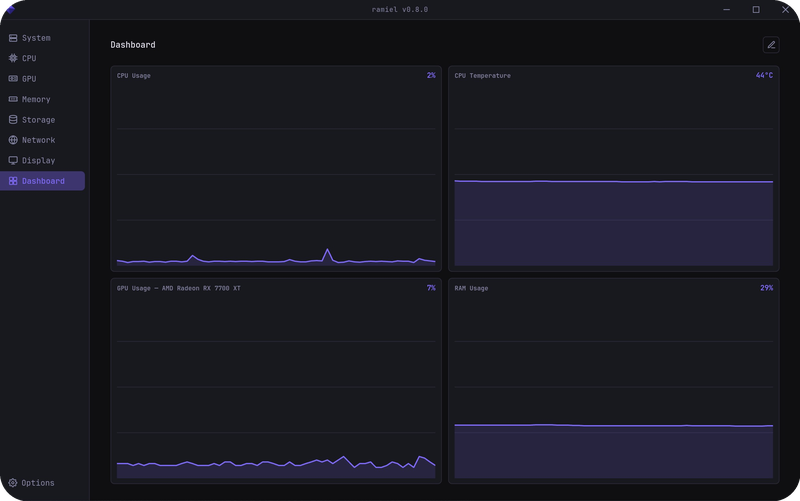
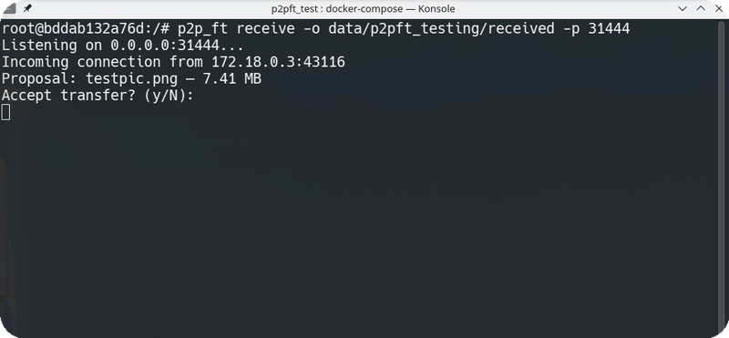
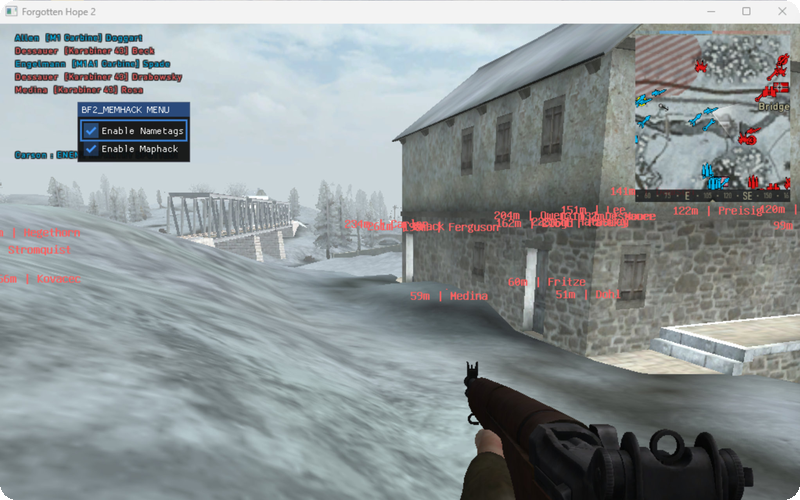

# Daniel Konoplański

### **C++ Software Engineer @ Nokia**

Building 4G/5G software used by over 1 billion users worldwide.

## 🚀 Featured Work

### [ramiel](https://github.com/daniel-konoplanski/ramiel)

Lightweight desktop hardware monitor for Linux — CPU, GPU, memory, storage, network, and display metrics without root access. Reads sensors directly from sysfs/hwmon, with live per-second charts on a customizable dashboard. Actively developed, with packaged releases (.deb, .rpm, AppImage).

Tauri v2 · Rust · Svelte

 

### [p2p_ft](https://github.com/daniel-konoplanski/p2p_file_transfer)

Minimal peer-to-peer file transfer tool for Linux. Direct encrypted transfers between two machines over TLS 1.2+ with auto-generated ECDSA certificates, chunked streaming, interactive approval prompts, and real-time progress tracking.

C++23 · Boost.Asio · Protocol Buffers

 

### [bf2_memhack_v2](https://github.com/daniel-konoplanski/bf2_memhack_v2)

Reverse-engineering project for Battlefield 2 and compatible mods (Forgotten Hope 2, Project Reality). An injected DLL that reads live game state from process memory — player nametags with distance, enemy positions on the minimap — controlled through an in-game UI menu.

C++ · DLL injection · Reverse engineering

 

### More projects

- **[silverspark](https://github.com/daniel-konoplanski/silverspark)** — AFK automation tool for Conqueror's Blade; deterministic move-settle-click input injection driving the DirectX client, toggled by a global F12 hotkey. `Python · pydirectinput · uv`
- **[bitmap_manipulator](https://github.com/daniel-konoplanski/bitmap_manipulator)** — Windows Forms desktop app demonstrating four classic image filters with real-time preview. `C# · .NET Framework`
- **[cpp_project_template](https://github.com/daniel-konoplanski/cpp_project_template)** — Batteries-included C++ template: clean src/include/tests layout, CMake presets and toolchains, clang-format/clangd, vcpkg. `CMake · vcpkg`

## 🛠️ Tech Stack

**Languages**

**Libraries & Frameworks**

**Tools & Platforms**

## 📘 Learning

- [asynchronous_programming_with_cpp](https://github.com/daniel-konoplanski/asynchronous_programming_with_cpp) — examples and tasks from *Asynchronous Programming with C++* by Reguera-Salgado & Rufes
- [moder_cpp_third_edition](https://github.com/daniel-konoplanski/moder_cpp_third_edition) — examples from *Modern C++ Programming Cookbook, 3rd Edition* by Marius Bancila
- [the_rust_programming_language](https://github.com/daniel-konoplanski/the_rust_programming_language) — examples from *The Rust Programming Language*
- [leetcode](https://github.com/daniel-konoplanski/leetcode) / [leetcode_rust](https://github.com/daniel-konoplanski/leetcode_rust) — LeetCode solutions in C++ and Rust
